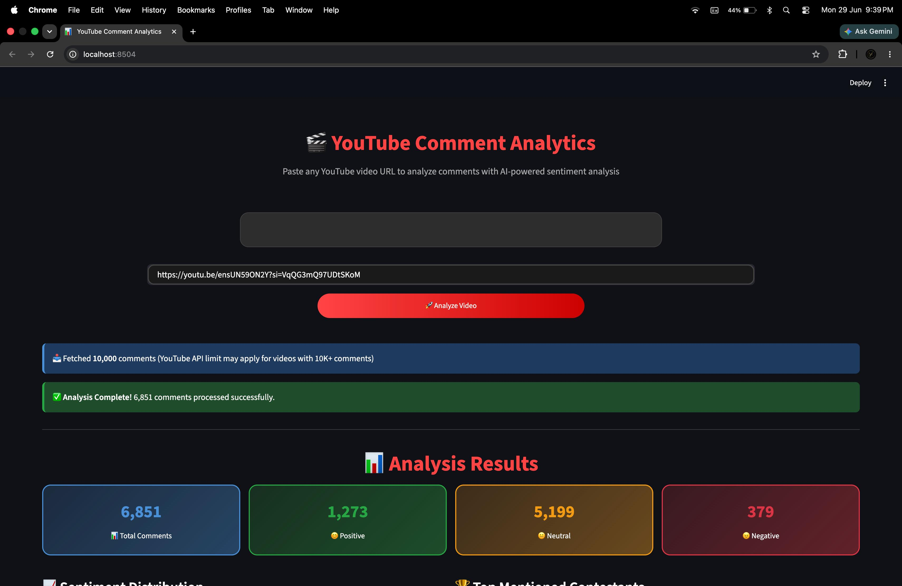
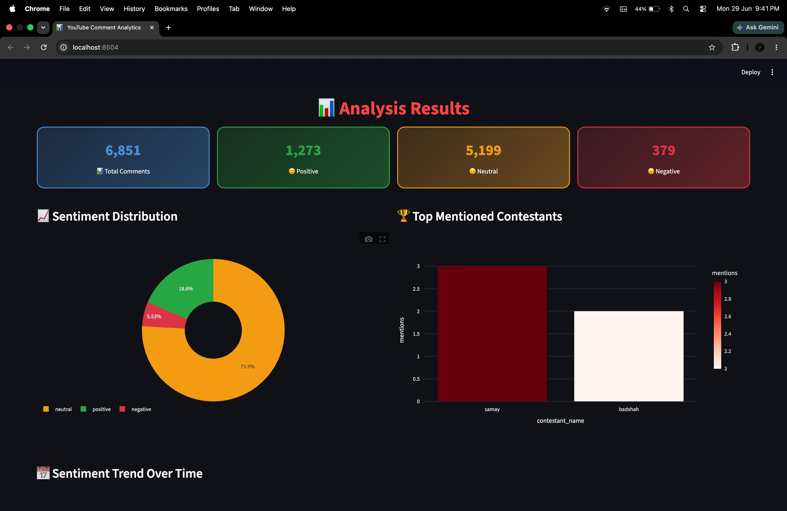
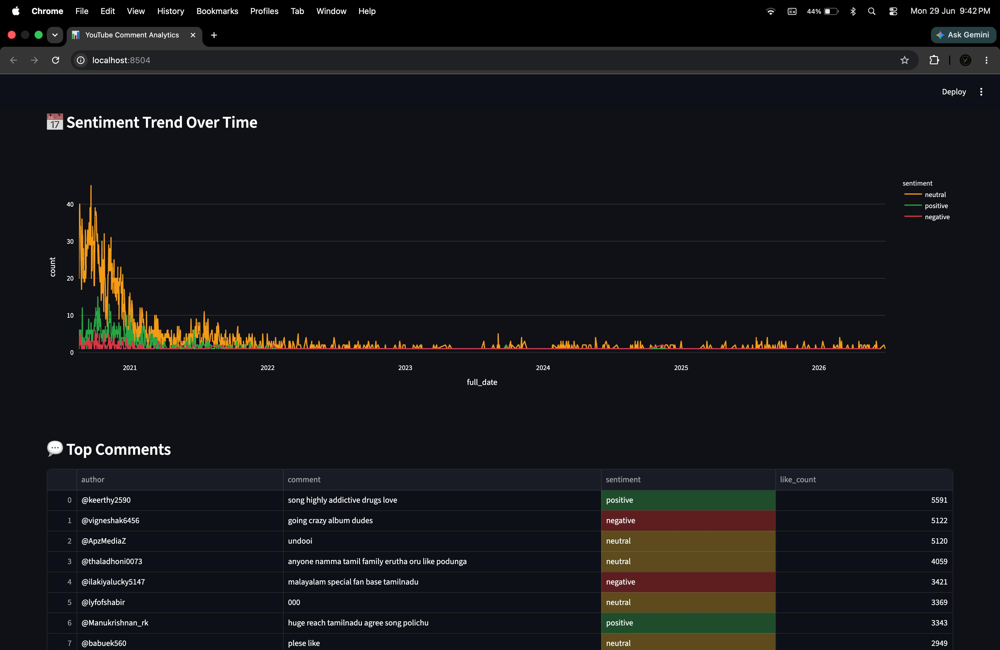

# 🎬 YouTube Comment Analytics Dashboard

<p align="center">
  
  
  
  
  
  
</p>

<p align="center">
<b>AI-powered YouTube Comment Analytics Dashboard using Python, Streamlit, MySQL and NLP</b><br>
Analyze YouTube comments, detect sentiment, discover contestant mentions, and visualize insights in real time.
</p>

---

# 📑 Table of Contents

- Overview
- Features
- Architecture
- Tech Stack
- Project Structure
- Installation
- Configuration
- Usage
- Dashboard Features
- Database Schema
- API Limits
- Screenshots
- Future Enhancements
- Contributing
- License

---

# 📌 Overview

This project extracts comments from YouTube videos using the **YouTube Data API v3**, cleans and preprocesses the data, performs **sentiment analysis using TextBlob**, stores processed records inside a **MySQL Star Schema**, and visualizes insights through an interactive **Streamlit dashboard**.

---

# ✨ Features

| Feature | Description |
|---------|-------------|
| 🔗 Video URL Analysis | Analyze any public YouTube video |
| 💬 Comment Extraction | Fetch comments using YouTube Data API |
| 🧹 Data Cleaning | Removes URLs, emojis, duplicates & unwanted characters |
| 🧠 Sentiment Analysis | Positive, Neutral and Negative classification |
| 🏆 Contestant Detection | Detect contestant mentions automatically |
| 📈 Trend Analysis | Time-based sentiment visualization |
| 📊 Interactive Dashboard | Plotly charts inside Streamlit |
| 🗄️ MySQL Storage | Star Schema Data Warehouse |
| ⚡ ETL Pipeline | Automated Extract → Transform → Load |

---

# 🏗️ Architecture

```text
YouTube Video URL
        │
        ▼
YouTube Data API
        │
        ▼
Comment Extraction
        │
        ▼
Data Cleaning
        │
        ▼
Sentiment Analysis
        │
        ▼
Contestant Detection
        │
        ▼
MySQL Database
        │
        ▼
Streamlit Dashboard
```

---

# 🛠 Tech Stack

| Layer | Technology |
|-------|------------|
| Language | Python 3.10+ |
| Frontend | Streamlit |
| Visualization | Plotly |
| Database | MySQL 8 |
| ORM | SQLAlchemy |
| NLP | TextBlob |
| Text Processing | NLTK |
| API | YouTube Data API v3 |
| Environment | python-dotenv |

---

# 📁 Project Structure

```text
youtube-comment-analytics/
│
├── scripts/
│   ├── app.py
│   ├── extract.py
│   ├── clean.py
│   ├── analyze.py
│   ├── load_to_mysql.py
│   └── dashboard.py
│
├── sql/
│   └── schema.sql
│
├── data/
├── screenshot/
│   ├── input.jpeg
│   ├── Analysis.jpeg
│   └── Sentiment.jpeg
│
├── requirements.txt
├── .env
├── .gitignore
└── README.md
```

---

# 📦 Installation

## 1. Clone Repository

```bash
git clone https://github.com/Madankk-06/Youtube_Comment_Analysis.git
cd Youtube_Comment_Analysis
```

## 2. Create Virtual Environment

```bash
python -m venv venv
```

Activate:

**Windows**

```bash
venv\Scripts\activate
```

**macOS / Linux**

```bash
source venv/bin/activate
```

## 3. Install Dependencies

```bash
pip install -r requirements.txt
```

## 4. Download NLTK Resources

```bash
python -c "import nltk;nltk.download('stopwords');nltk.download('punkt')"
```

---

# ⚙️ Configuration

Create a `.env` file.

```env
YOUTUBE_API_KEY=YOUR_API_KEY

DB_HOST=localhost
DB_USER=root
DB_PASSWORD=your_password
DB_NAME=youtube_analytics
```

Create Database

```sql
CREATE DATABASE youtube_analytics;
```

Run Schema

```bash
mysql -u root -p youtube_analytics < sql/schema.sql
```

---

# 🚀 Usage

Run the application

```bash
streamlit run scripts/app.py
```

Open

```text
http://localhost:8501
```

Workflow

1. Paste YouTube URL.
2. Click **Analyze Video**.
3. Wait for extraction.
4. Comments are cleaned.
5. Sentiment is calculated.
6. Data is stored in MySQL.
7. Dashboard is generated.

---

# 📊 Dashboard Features

- Sentiment Distribution
- Top Contestants
- Most Liked Comments
- Sentiment Trend
- Total Comments
- Positive/Negative Ratio
- Interactive Plotly Charts

---

# 🗄 Database Schema

Star Schema

- **Fact Table**
  - fact_comments
  - fact_mentions

- **Dimension Tables**
  - dim_date
  - dim_contestant

- **Staging**
  - staging_comments

---

# ⚠ API Limits

| Metric | Value |
|---------|------:|
| Daily Quota | 10,000 Units |
| Cost | 1 Unit / 100 Comments |
| Approx Comments | 7K–10K per day |

---

# 🖼 Screenshots

## Input



---

## Dashboard



---

## Sentiment Analysis



---

# 🚀 Future Enhancements

- Multi-language sentiment analysis
- Transformer-based NLP
- User authentication
- Docker deployment
- Cloud deployment
- Live analytics
- Export reports

---

# 🤝 Contributing

1. Fork the repository.
2. Create a feature branch.
3. Commit your changes.
4. Push the branch.
5. Open a Pull Request.

---

# 📄 License

Licensed under the MIT License.

---

<p align="center">

Made with ❤️ by **Madan KK**

⭐ If you found this project useful, don't forget to star the repository.

</p>
